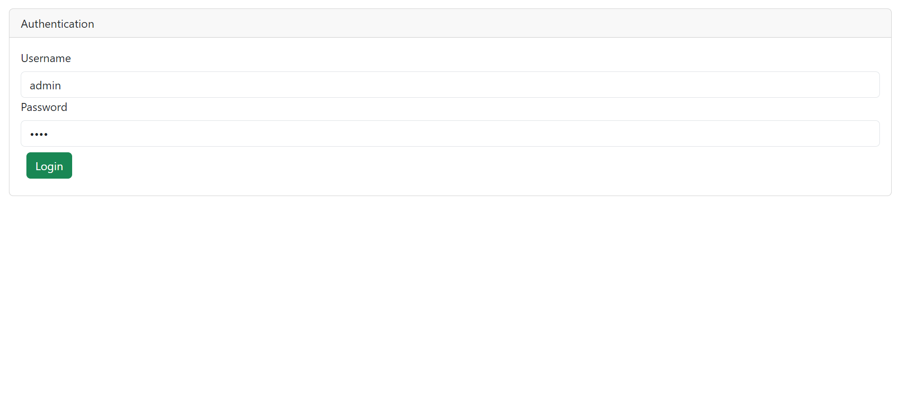
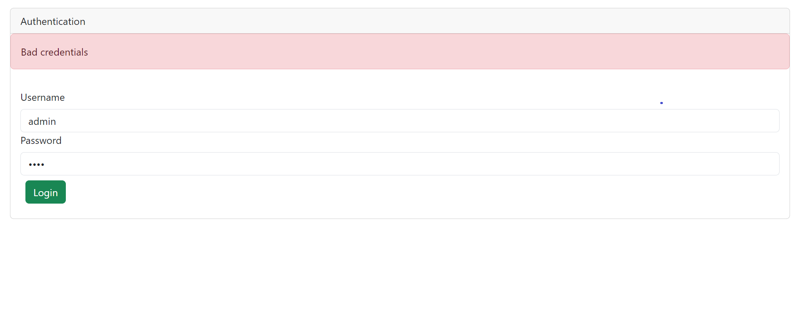
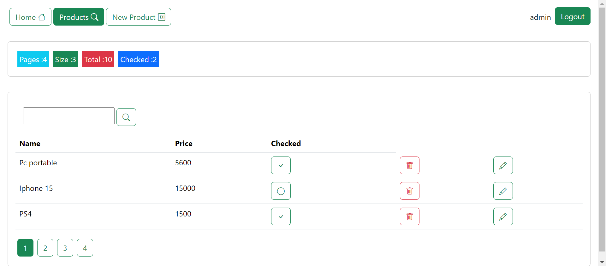
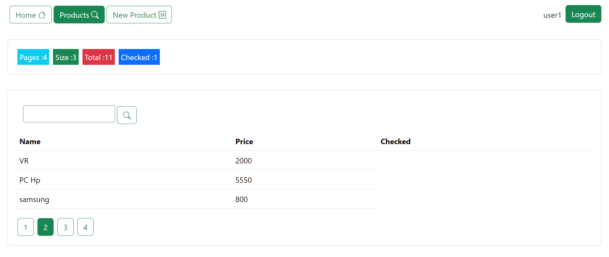
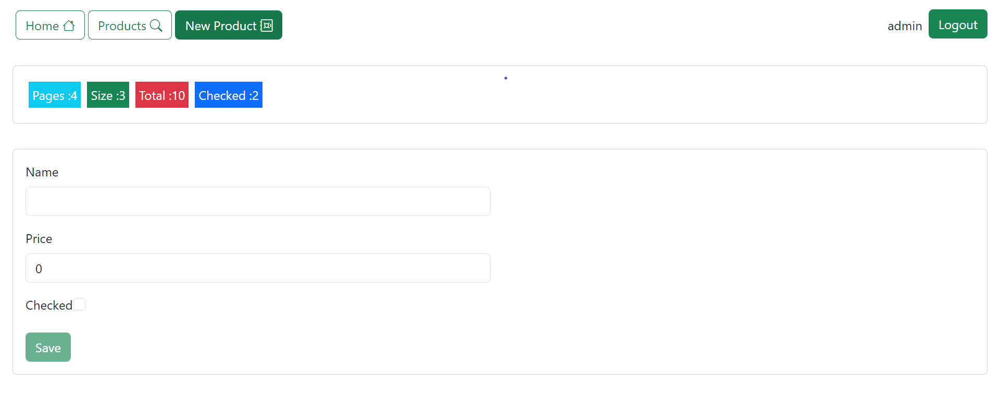
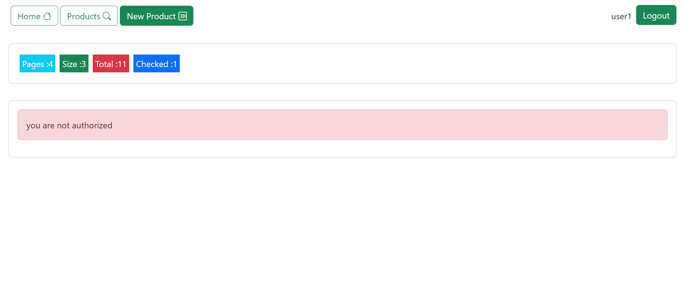
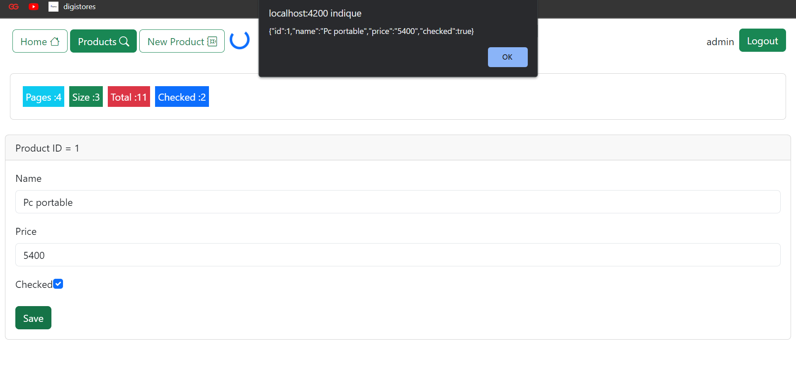
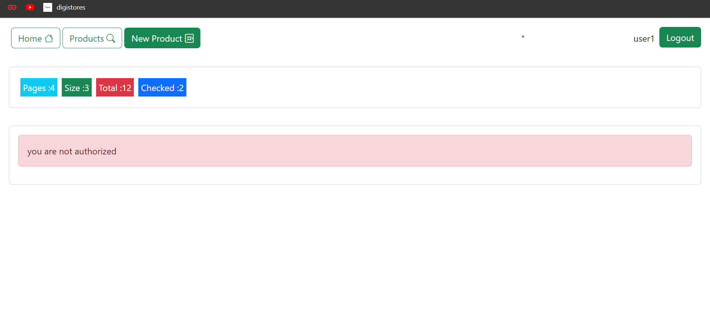
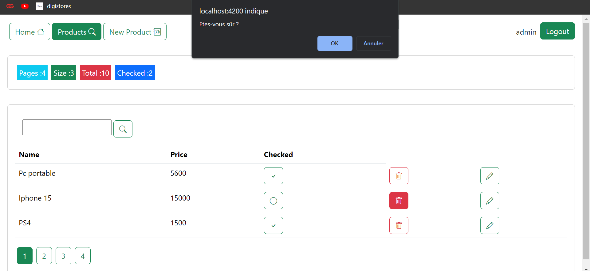

<h3>Compte rendu</h3>

<h1>partie authentification</h1>

<h1>authentification si le mdp ou username est incorrect</h1>

<h1>produits dans la partie admin</h1>

<h1>Produits dans la partie user</h1>

<h1>New-produits dans la partie admin</h1>

<h1>New-produits dans la partie user</h1>

<h1>Edit produit dans la partie admin</h1>

<h1>Edit produit dans la partie user</h1>

<h1>Supression de produits</h1>

